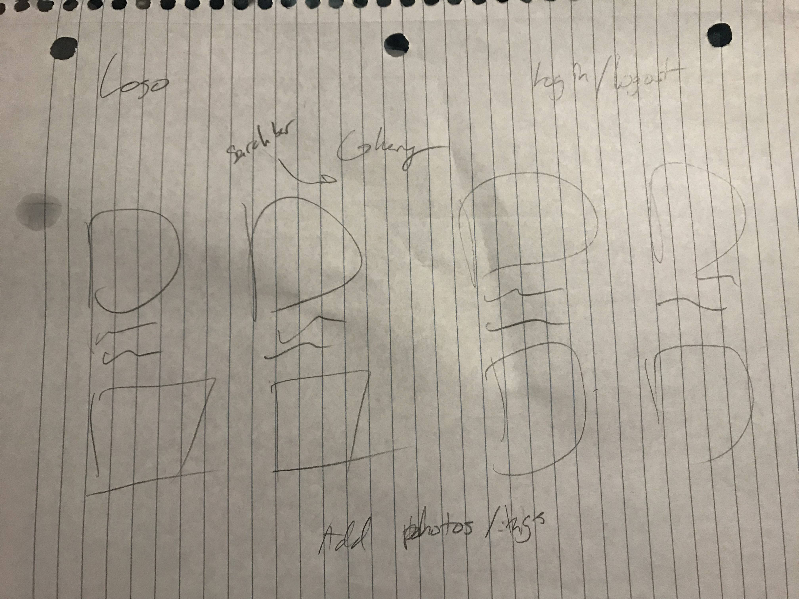
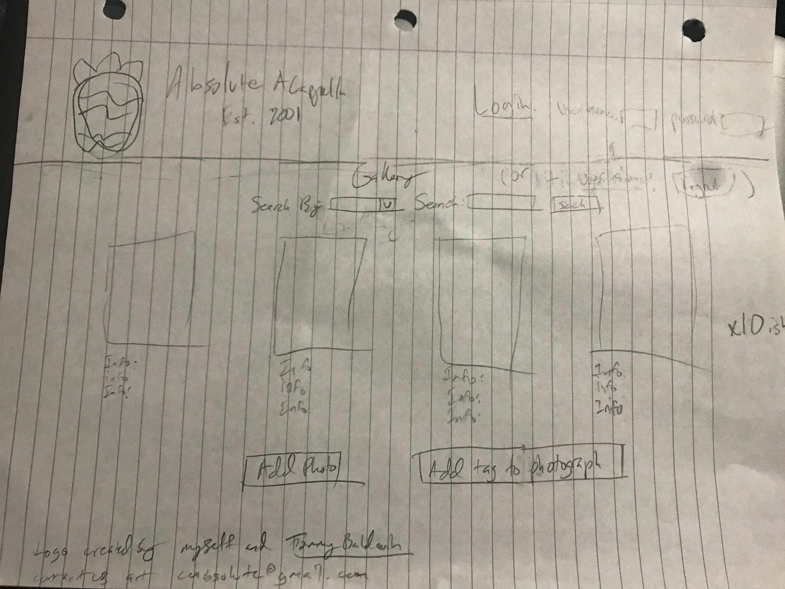
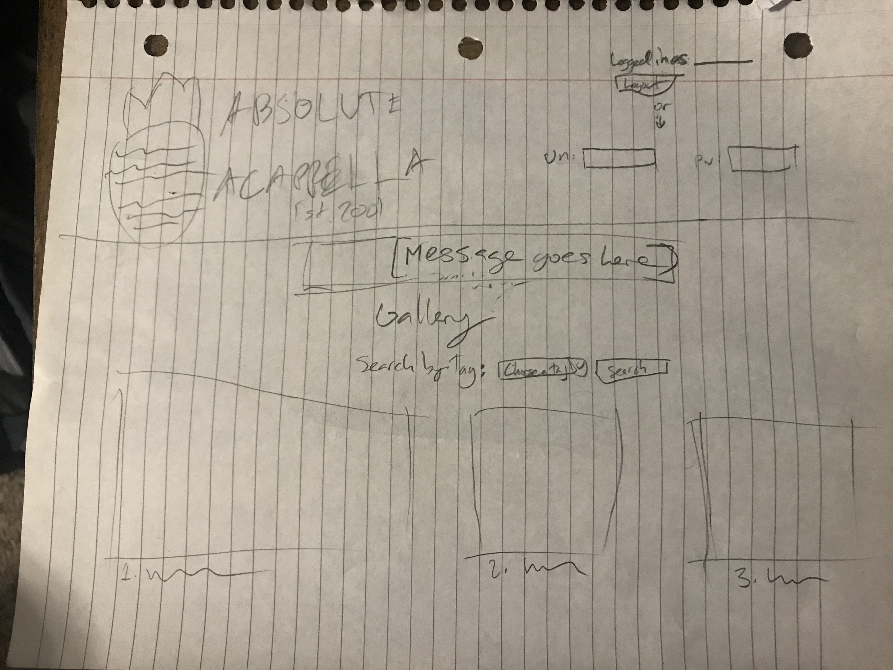
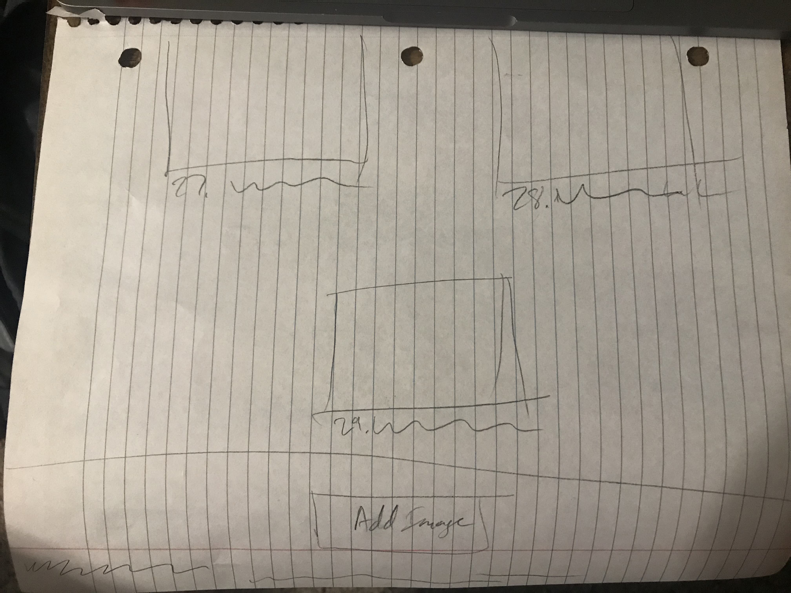
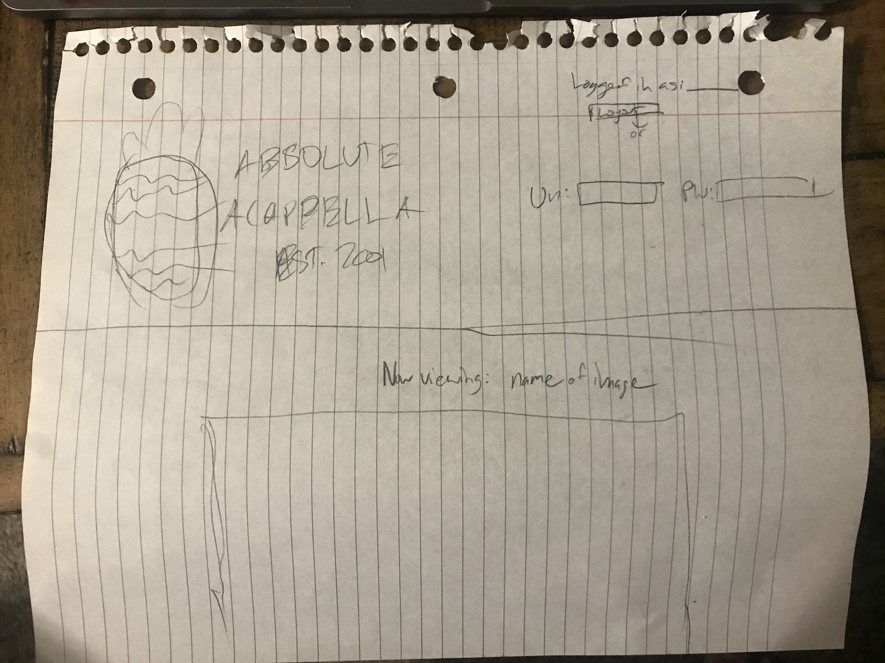
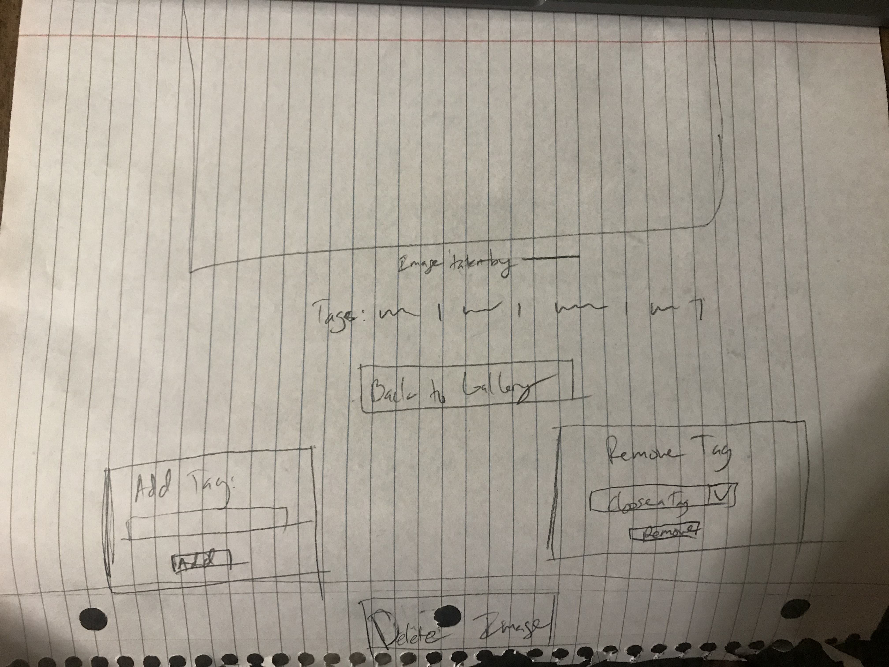

# Project 3: Design Journey

Your Name: Shea Murphy

**All images must be visible in Markdown Preview. No credit will be provided for images in your repository that are not properly linked in Markdown. Assume all file paths are case sensitive!**


# Project 3, Milestone 1 - Design, Plan, & Draft Website

## Describe your Gallery

My gallery will be all of the professional photographs that my a cappella group, Absolute A Cappella, has had taken during our performances.


## Target Audiences

For this project, I will have two main target audiences: the members of our acappella group, and the fans/ parents of our acappella group. The members of the acappella group range from ages 18 to 24 and are both male and female. The parents and fans of our acappella group are anywhere from their teens to their 50's, and again can be either male or female.


## Design Process

First, I made an incredibly rough sketch to decide the placement of various elements that I need to include:


I then started sketching on the backside a more refined version of the sketch that shows a more accurate physical placement for most parts of the site. This sketch includes all forms, with both versions of login/ logout:


Currently, I am not 100% sure what my situation will be for adding images/ tags, but I am assuming I will use separate pages for each, which in that case would consist of a form taking user input to add the various fields into the database. When I am for sure on how I will implement this, I will sketch them and update this document.

I coded a rough draft for the website during the first two milestones with little functionality implemented yet. As we learned things from the labs and lectures I slowly implemented different backend functionalities.

When beginning the final milestone, I began by implementing the rest of the backend stuff, and in the process ended up deciding to make changes to the locations of adding and removing images as well as adding and removing tags. I also ended up adding a second page to serve as a way to view larger versions of single images, which now houses some of the functionalities just mentioned. These sketches represent these physical changes to the sites layout, and serve as a guide for my final websites layout:


## Final Design Plan

Here are the sketches that represent my final design plan:





## Templates

I will include a header template and a footer template. The header will house our logo, as well as the login form, and the footer will hold appropriate citations regarding the logo as well as some basic contact information. I will also have a template to show a form for adding images to the database in order to make the code on my index page more legible.

## Database Schema Design

[Describe the structure of your database. You may use words or a picture. A bulleted list is probably the simplest way to do this. Make sure you include constraints for each field.]

[Hint: You probably need `users`, `images`, `tags`, and `image_tags` tables.]

[Hint: For foreign keys, use the singular name of the table + _id. For example: 1) `user_id` in the `images` table or 2) `image_id` and `tag_id` for the `image_tags` table.]

```
user (
id : INTEGER {PK, U, Not, AI}
fullname : TEXT {Not}
username : TEXT {Not}
password : TEXT {Not}
)

images (
id : INTEGER {PK, U, Not, AI}
imgname : TEXT {Not}
ext : TEXT {Not}
description : TEXT
user_id : INTEGER {Not}
)

tags (
id : INTEGER {PK, U, Not, AI}
tag : TEXT {Not}
)

image_tags (
id : INTEGER {PK, U, Not, AI}
tag_id : TEXT {Not}
image_id : TEXT {Not}
)
```


## Code Planning

[Plan what top level PHP pages you'll need.]
```
index.php
fullview.php
```


[Plan what templates you'll need.]
```
init.php
header.php
footer.php
addimage.php
```

[Plan any PHP code you'll need.]
```
function log_in($username, $password) {
  global $db;
  global $current_user;
  global $messages;
  if (isset($username) && isset($password)) {
    $sql = "SELECT * FROM users WHERE username = :username;";
    $params = array(':username' => $username);
    $records = exec_sql_query($db, $sql, $params)->fetchAll();
    if ($records) {
      $login_user = $records[0];
      if (password_verify($password, $login_user['password'])) {
        $session = session_create_id();
        $sql = "INSERT INTO sessions (user_id, session) VALUES (:user_id, :session);";
        $params = array(':user_id' => $login_user['id'], ':session' => $session);
        $result = exec_sql_query($db, $sql, $params);
        if ($result) {
          setcookie("session", $session, time() + SESSION_DURATION);
          $current_user = $login_user;
          return $current_user;
        }
        else {
          array_push($messages, "Log in failed.");
        }
      }
      else {
        array_push($messages, "Invalid username or password.");
      }
    }
    else {
      array_push($messages, "Invalid username or password.");
    }
  }
  else {
    array_push($messages, "Please enter a username and password.");
  }
  $current_user = NULL;
  return NULL;
}

function find_session($session) {
  global $db;
  if (isset($session)) {
    $sql = "SELECT * FROM sessions WHERE session = :session;";
    $params = array(
      ':session' => $session
    );
    $records = exec_sql_query($db, $sql, $params)->fetchAll();
    if ($records) {
      return $records[0];
    }
  }
  return NULL;
}

function find_user($user_id) {
  global $db;
  $sql = "SELECT * FROM users WHERE id = :user_id;";
  $params = array(':user_id' => $user_id);
  $records = exec_sql_query($db, $sql, $params)->fetchAll();
  if ($records) {
    return $records[0];
  }
  return NULL;
}

function session_login() {
  global $current_user;
  if (isset($_COOKIE["session"])) {
    $session = $_COOKIE["session"];
    $session_record = find_session($session);
    if (isset($session_record)) {
      $current_user = find_user($session_record['user_id']);
      setcookie("session", $session, time() + SESSION_DURATION);
      return $current_user;
    }
  }
  $current_user = NULL;
  return NULL;
}

function is_user_logged_in() {
  global $current_user;
  return ($current_user != NULL);
}

function log_out() {
  global $current_user;
  setcookie('session', '', time() - 1);
  $current_user = NULL;
}

if (isset($_POST['submit_login']) && isset($_POST['username']) && isset($_POST['password'])) {
  $username = trim($_POST['username']);
  $password = trim($_POST['password']);
  log_in($username, $password);
}
else {
  session_login();
}

if (isset($current_user) && (isset($_GET['submit_logout']) || isset($_POST['submit_logout']))) {
  log_out();
}
```


## Database Query Plan

1. All records

  SELECT * FROM images INNER JOIN users ON images.user_id = user.id;

2. Search by tag

  SELECT * FROM images INNER JOIN image_tags ON images.id = image_tags.image_id WHERE image_tags.tag_id = '%'||:tag_id||'%';

3. Insert image

  INSERT INTO images (img_name, ext, description, user_id) VALUES (:img_name, :ext, :description, :user_id)

4. Remove image and its tags

  DELETE FROM image_tags WHERE image_tags.image_id = ".$image_id

  DELETE FROM images WHERE images.id = ".$image_id

5. Insert tag

If the tag does not exist yet:

  INSERT INTO tags (tag) VALUES (:tag)

Check for duplicate tag:

  SELECT image_tags.image_id FROM image_tags WHERE image_tags.tag_id = ".get_tag_id($user_tag)

  INSERT INTO image_tags (tag_id, image_id) VALUES (:tag_id, :image_id)

6. Remove tag

  DELETE FROM image_tags WHERE image_tags.image_id = ".$image_id." AND image_tags.tag_id = ".$tag_id

If this is the last image tagged with this tag:

  DELETE FROM tags WHERE tags.id = ".$tag_id


# Project 3, Milestone 2 - Gallery and User Access Controls

## Issues & Challenges

My biggest challenge so far in completing milestone 2 was that I got stumped by the search by tag SQL query, mostly because I know you have to do subsequent queries in order to combine multiple tables and as of right now I am not sure I know how. Thus, my search is implemented outside of this query. Other than this, I just didn't have a great concept for how to implement the single page showing all info for an image, but after learning query strings in lecture I now understand much better and have partially implemented.


# Final Submission: Complete & Polished Website

## Reflection

My ability to comprehend and write PHP code (along with HTML) has improved greatly since the beginning of this class, mostly due to the immense amount of practice that has been required. I also have gained proficiency in writing SQL documents to generate databases, as well as using SQL queries to obtain information and manage database content.
